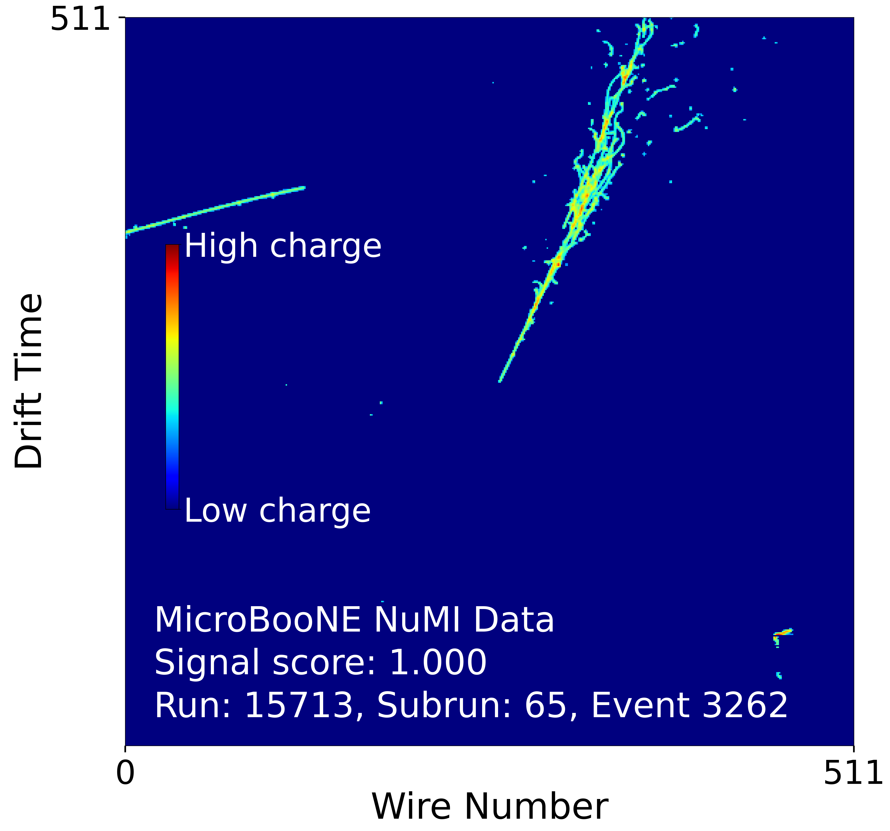

# Dark Trident GNN

Graph Neural Network classifier for dark trident BSM signal detection in MicroBooNE LArTPC data.



*MicroBooNE NuMI beam-on data event with GNN signal score 1.000. The colour scale represents charge deposition (ADC), with red indicating high charge. The shower-like topology is characteristic of a dark trident candidate.*

## Overview

This repository implements GNN-based binary classifiers to distinguish dark trident signal events (e+e- pairs from dark matter interactions) from Standard Model backgrounds. The work extends the CNN-based analysis of Lepin (2024) by representing LArTPC events as graph structures.

Each event is represented as a graph where nodes are hit pixels extracted from the Y-plane wire image (wire, time, ADC) from the MPID dataset (Simulated, image data only), connected via K-Nearest Neighbour edges.

## Models

### GraphConv GNN (`train_gnn.py`)
- 4-layer GraphConv with BatchNorm and ReLU
- Global mean + max pooling
- Hidden dims: [32, 64, 128, 256]
- Early stopping (patience=10, smoothed over 5 epochs)

### TransformerConv GNN (`train_gnn_transformer.py`)
- 4-layer TransformerConv with multi-head attention (heads=4)
- Edge features: wire distance, time distance, ADC difference
- Global mean + max pooling
- Hidden dims: [32, 64, 128, 256]
- Early stopping (patience=10, smoothed over 5 epochs)
- Based on Shi et al. (2020) Section 3.1 — attention mechanism only; label propagation and masked prediction not used

## Data

| Dataset | Type | Purpose |
|---------|------|---------|
| MPID training set (62k events) | Simulation | Model training |
| MPID test set (6.9k events) | Simulation | Performance evaluation (AUC, ROC) |
| Run 1 & Run 3 signal simulation | Simulation | Signal efficiency measurement |
| Run 3 NuMI beam-on data | Real data | Data/MC comparison |

## Pipeline

1. `convert_to_hdf5.py` — Convert LArCV ROOT files to HDF5 spacepoint format
2. `make_graphs.py` — Build KNN graphs (node features only)
3. `make_graphs_edge.py` — Build KNN graphs with edge features (wire/time distance, ADC difference)
4. `train_gnn.py` — Train GraphConv model
5. `train_gnn_transformer.py` — Train TransformerConv model
6. `inference_gnn.py` — Evaluate GraphConv: ROC curve, AUC, score distribution
7. `inference_gnn_transformer.py` — Evaluate TransformerConv + attention weight visualisation
8. `occlusion_analysis.py` — Node removal study to identify spatially important regions
9. `inference_run3.py` — Apply model to Run 3 NuMI beam-on data
10. `inference_run1_signal.py` / `inference_run3_signal.py` — Signal efficiency measurement

## Results

| Model | AUC | Test Accuracy |
|-------|-----|---------------|
| CNN baseline (Lepin 2024) | 0.9512 | - |
| GraphConv GNN | 0.9740 | 0.9242 |
| TransformerConv GNN | 0.9832 | 0.9473 |

## Interpretability

Attention weight visualisation shows uniform attention across nodes, indicating the model aggregates global event topology during message passing. Occlusion analysis reveals the vertex region as the critical spatial determinant for classification — consistent with the e+e- pair topology of the dark trident signal.

## Planned

- Training size scan: GNN vs CNN data efficiency comparison (also compared with neuromorphic network and Vision Transformer)
- Exclusion contour: 90% CL limits on ε² as a function of MA′

## Libraries Required

```bash
pip install torch torch_geometric h5py scikit-learn networkx torchinfo
```

## Alternative

`alternative/gnn_example_joe.ipynb` contains the original GNN example notebook by Joe Bateman.