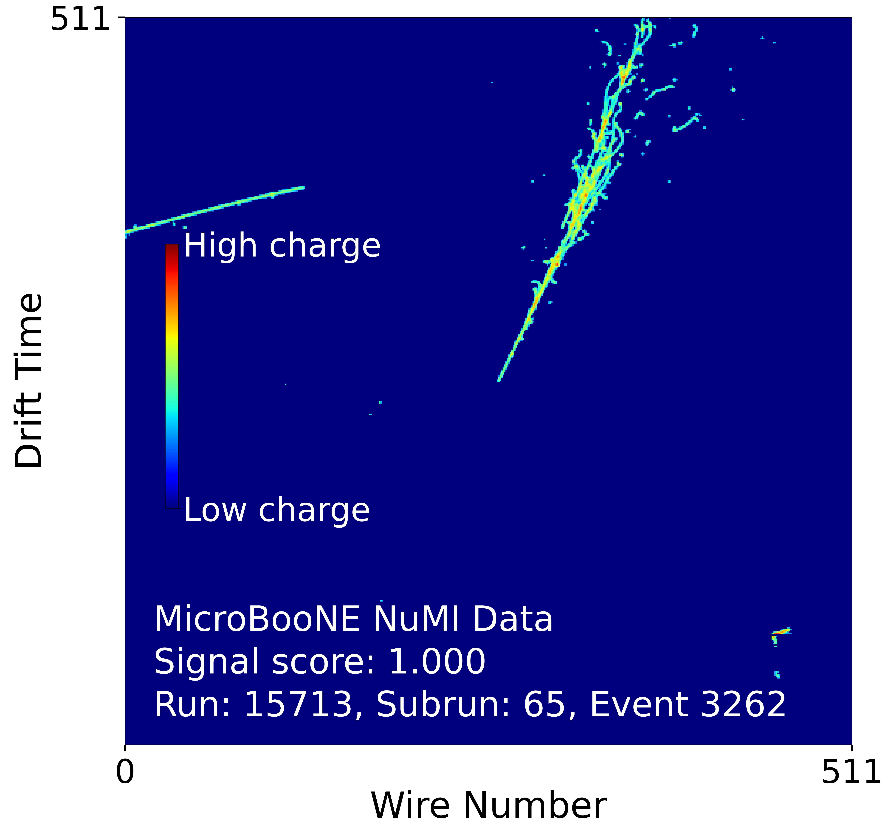
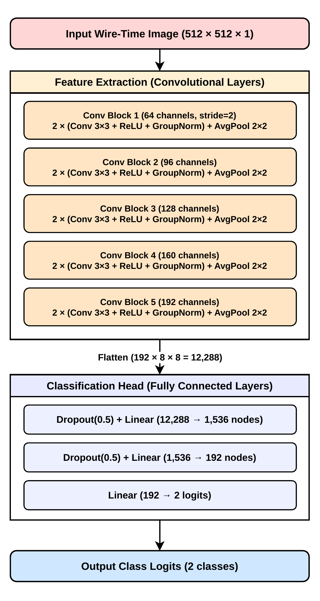
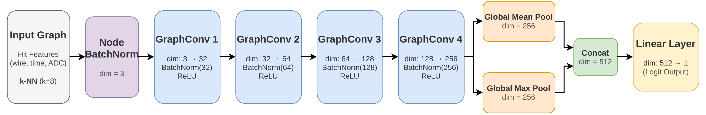
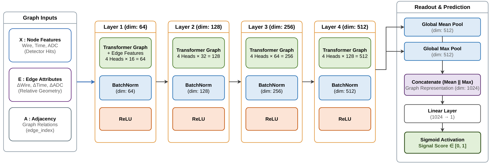
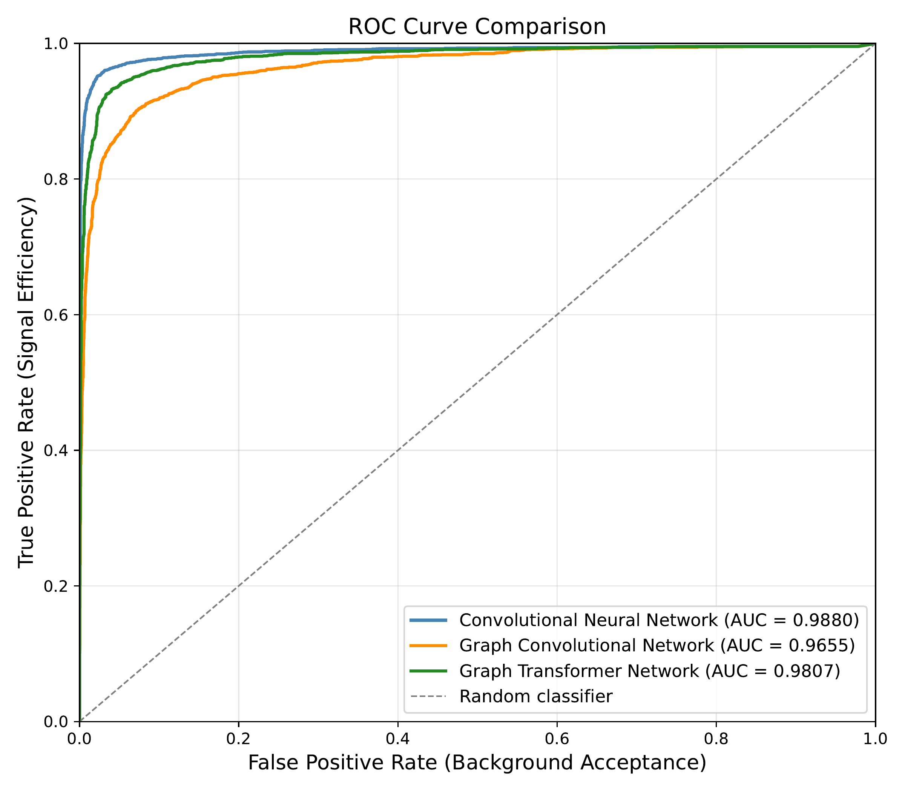
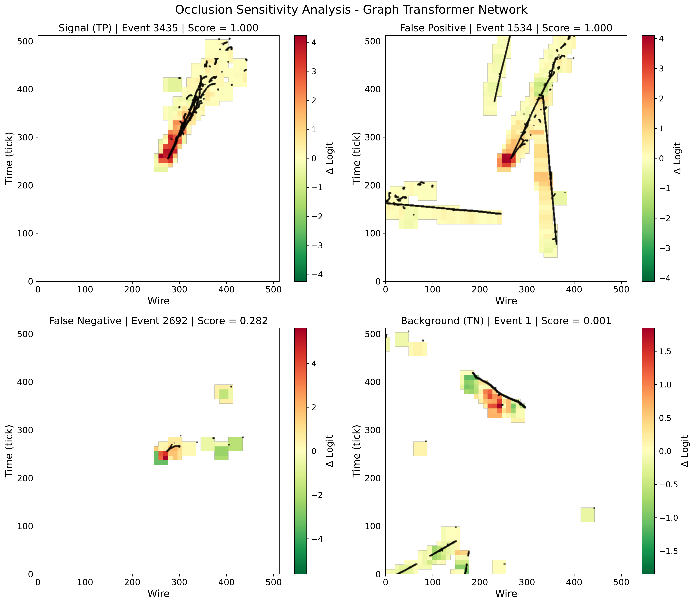
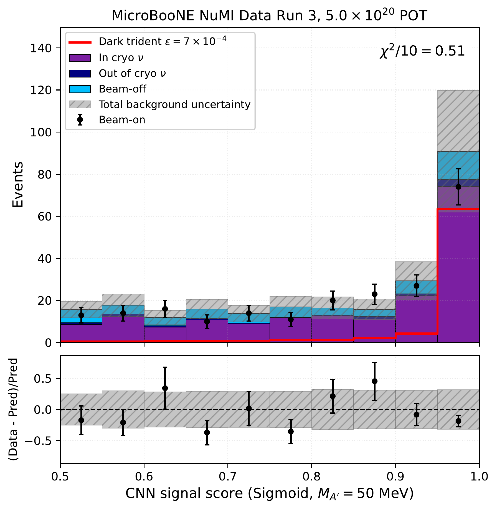

# Dark Trident GNN

Graph Neural Network classifier for dark trident BSM signal detection in MicroBooNE LArTPC data.

<p align="center">
  
</p>

*MicroBooNE NuMI beam-on data event with GNN signal score 1.000. The colour scale represents charge deposition (ADC), with red indicating high charge. The shower-like topology is characteristic of a dark trident candidate.*

## Overview

This repository implements GNN-based binary classifiers to distinguish dark trident signal events (e+e- pairs from dark matter interactions) from Standard Model backgrounds. The work extends the CNN-based analysis of Lepin (2024) by representing LArTPC events as graph structures.

Each event is represented as a graph where nodes are hit pixels extracted from the Y-plane wire image (wire, time, ADC) from the MPID dataset, connected via K-Nearest Neighbour edges (k=8). Empty events (spacepoints = 0) are excluded from training and evaluation for fair comparison across models.

## Models

### Convolutional Neural Network (baseline, Lepin 2024)

<p align="center"></p>

### Graph Convolutional Network (`train_gnn.py`)

<p align="center"></p>

- 4-layer GraphConv with BatchNorm and ReLU
- Global mean + max pooling
- Hidden dims: [32, 64, 128, 256]
- Optimiser: RAdam, lr=5e-4 (selected via LR range test, Smith 2017/2018)
- Early stopping: patience=5
- LR scheduler: ReduceLROnPlateau (factor=0.2, patience=5)

### Graph Transformer Network (`train_gnn_transformer.py`)

<p align="center"></p>

- 4-layer TransformerConv with multi-head attention (heads=4)
- Edge features: signed wire distance, drift-time distance, ADC difference
- Global mean + max pooling
- Hidden dims: [16, 32, 64, 128]
- Optimiser: RAdam, lr=1e-4 (selected via LR range test, Smith 2017/2018)
- Early stopping: patience=5
- LR scheduler: ReduceLROnPlateau (factor=0.2, patience=5)
- Based on Shi et al. (2020) Section 3.1 — attention mechanism only; label propagation and masked prediction not used

## Data

| Dataset | Type | Purpose |
|---------|------|---------|
| MPID training set (62,058 events after empty exclusion) | Simulation | Model training |
| MPID test set (6,911 events after empty exclusion) | Simulation | Performance evaluation (AUC, ROC) |
| Run 1 & Run 3 signal simulation | Simulation | Signal efficiency measurement |
| Run 3 NuMI beam-on data (5.0 × 10²⁰ POT) | Real data | Data/MC comparison |

## Pipeline

1. `convert_to_hdf5.py` — Convert LArCV ROOT files to HDF5 spacepoint format
2. `make_graphs.py` / `make_graphs_edge.py` / `make_graphs_edge_signed.py` — Build KNN graphs (node-only / with edge features / with signed edge features)
3. `lr_finder.py` — Learning rate range test (Smith 2017/2018)
4. `train_gnn.py` / `train_gnn_transformer.py` — Train GCN / Graph Transformer
5. `inference_gnn.py` / `inference_gnn_transformer.py` — Evaluate on test set: ROC, AUC, score distributions
6. `bootstrapping.py` — Bootstrapped AUC uncertainty (N=1,000 resamples)
7. `delong_test.py` — DeLong test for pairwise AUC significance
8. `occlusion_analysis.py` — Node removal study for spatial interpretability
9. `tsne_analysis.py` — Layer-wise t-SNE node embedding visualisation
10. `inference_run3_signal.py` / `plot_run3_histogram.py` — Apply best model to Run 3 NuMI beam-on data

## Results

Final classification performance on the held-out test set (N = 6,911), with bootstrapped uncertainties (N = 1,000 resamples):

| Model | AUC | 95% CI (AUC) | Test Accuracy | Training Time | Parameters |
|-------|-----|--------------|----------------|----------------|------------|
| CNN (Lepin 2024, baseline) | 0.9880 ± 0.0016 | [0.9848, 0.9909] | 95.43 ± 0.22% | ~215 min | 20,631,938 |
| GCN | 0.9655 ± 0.0023 | [0.9609, 0.9701] | 91.72 ± 0.34% | ~22 min | 88,167 |
| Graph Transformer | 0.9807 ± 0.0017 | [0.9771, 0.9841] | 94.46 ± 0.26% | ~79 min | 695,879 |

<p align="center"></p>

**DeLong test (pairwise AUC significance):**

| Comparison | z-statistic | p-value |
|------------|-------------|---------|
| CNN vs Graph Transformer | 2.734 | 0.0063 |
| CNN vs GCN | 13.265 | < 0.0001 |
| Graph Transformer vs GCN | 8.986 | < 0.0001 |

All pairwise differences are statistically significant (α = 0.05), though the absolute AUC gap between CNN and Graph Transformer is small (0.0046). The GCN trades ~2% AUC for a ~10x reduction in training time and ~230x fewer parameters than the CNN — a strong candidate for high-throughput or real-time filtering applications.

## Interpretability

- **Occlusion analysis** (Graph Transformer): the vertex region is the dominant spatial determinant for classification, consistent with the e+e- pair topology of the dark trident signal.

<p align="center"></p>

- **t-SNE node embeddings** (layer-wise): signal and background separate progressively by layer; Layer 4 shows sub-clustering within the signal region, likely reflecting kinematic variation (shower energy, opening angle) across simulated dark-trident parameters.

## Application to Run 3 Beam-on Data

CNN classifier score distribution applied to MicroBooNE NuMI Run 3 data (5.0 × 10²⁰ POT), score > 0.5 region, after topological preselection:

<p align="center"></p>

- **χ²/dof = 0.51** (10 dof) — observed data consistent with Standard Model background prediction
- Local excess in the 0.85–0.90 score bin (N_obs = 23 vs. N_exp = 15.81 ± 4.90) is a +1.05σ fluctuation, not a signal excess
- No evidence for a dark-trident signal at benchmark parameters (M_A' = 50 MeV, M_χ/M_A' = 0.6, α_D = 0.1)

## Neuromorphic Computing (Preliminary)

Photonic neuromorphic classifier (Ng et al.) benchmarked against the CNN in the low-data regime: exceeds 80% accuracy on Signal vs. Background classification with only ~100 training images, where the CNN needs several hundred. Full results and data-prep code: [Dark_Trident_Neuromorphic](https://github.com/JSL0328/Dark_Trident_Neuromorphic).

## Planned

- [ ] Edge feature ablation study (Graph Transformer with/without edge features) — scripts present (`train_gnn_transformer_noedge.py`), results pending
- [ ] Full neuromorphic training-size scan on the full 62,058-image dataset
- [ ] Systematic investigation of Graph Transformer signal sub-clusters (t-SNE Layer 4) by simulation parameters (M_A', ε)

## Libraries Required

```bash
pip install torch torch_geometric h5py scikit-learn networkx torchinfo optuna
```

## References

- Shi et al. (2020): Masked Label Prediction — TransformerConv (Section 3.1 only)
- Smith (2017/2018): Cyclical Learning Rates / Disciplined approach to neural network hyper-parameters
- Shlomi et al. (2021): Graph Neural Networks in Particle Physics
- Lepin (2024): A Search for Dark Tridents Using the MicroBooNE Detector (MRes thesis, Imperial College London)
- Ng et al.: Neuromorphic photonic classification system

## Alternative

`alternative/gnn_example_joe.ipynb` contains the original GNN example notebook by Joe Bateman.
